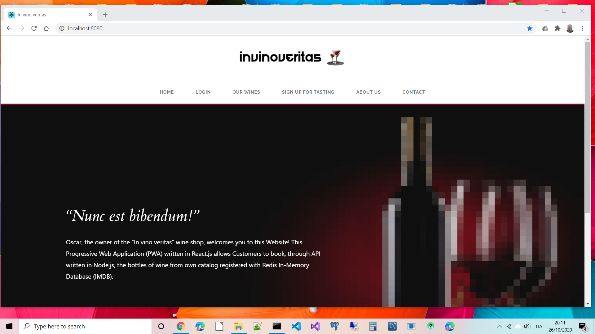

:node_version: current
:redis_version: current
:react_version: current
:toc:
:project_id: invinoveritas-node-redis-react
:icons: font
:source-highlighter: prettify

= Welcome to invinoveritas-node-redis-react !

Description of the project: invinoveritas-node-redis-react is an e-commerce Web Site for a Wine Shop callled "In vino veritas" in node.js, redis and react.js.
In other words, Oscar, the owner of the wine shop "In vino veritas", needs a web application that allows his Customers to book the wine bottles of his catalog.

[[initial]]
== invinoveritas-node-redis-react Description

invinoveritas-node-redis-react is a project based on Node 12, Redis 5 and React 17 to work out the life cycle of wine bottles reservation.

[[initial]]
== Set up Docker Images

after downloading from git:

- build the project with Docker Compose in no cache mode:

[subs="attributes"]
----
./cd invinoveritas-node-redis-react
./docker-compose build --no-cache
----

- then you can see the last log row: 

[subs="attributes"]
----
Successfully tagged invinoveritas-node-redis-react_react-server:latest
----

- then launch Docker Compose:

[subs="attributes"]
----
./docker-compose up
----

then open your favorite browser and enter http://localhost:8080  in the address bar and you can see:

== Home Page

----
----

----
----

== Login

----
----

== Welcome

----
----

----
----

== Catalog

----
----

----
----

== Wine Selected

----
----

image::images/wine_selected.png[]

----
----

== Booking with one product

----
----

----
----

== Booking with more products

----
----

----
----

== Purchase

----
----

----
----

== Payment

----
----

----
----

== My Payments

----
----

----
----

== Logout

----
----

----
----
